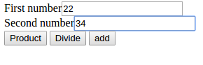
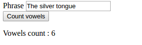
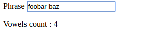
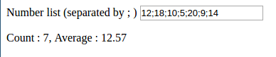
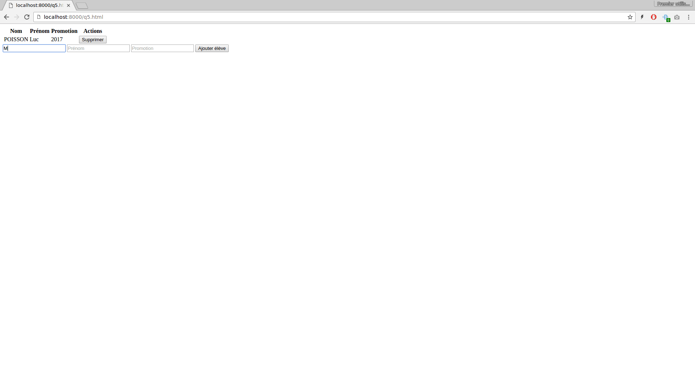

TP 1
====

### A lire attentivement avant de commencer

Le but de ce TP est d'appliquer les premiers concepts vus en cours.

Les TPs se font seuls ou par équipe de deux personnes. Tous les élèves de l'équipe doivent participer (taper au clavier, réfléchir aux exercices).

Chaque question doit être traitée en apportant en réponse le code souhaité ainsi qu'un texte explicatif. Le format du fichier de réponse est le code nécessaire au fonctionnement du programme. Par exemple, pour la question 1, on crée un fichier `question1.html`.

Si il faut rajouter des explications, créer un simple `.txt`, unique pour chaque TP, formatté en markdown.

Le but de ce TP est de s'entrainer à écrire du JS et manipuler le DOM

Question 1
----------

Écrire un programme qui permet d'entrer deux nombres dans des champs, et permet de soit les additionner, les multiplier ou les diviser :

Le but est également de factoriser le code commun aux fonctions écrites (c'est à dire utiliser `.innerHTML` une seule fois dans le code, et parseInt un maximum deux fois).

Question 2
----------

Écrire un programme qui compte le nombre de voyelles dans une phrase quand on clique sur le bouton "Count vowels".

Question 3
----------

Le but de cette question est simplement d'améliorer le résultat de la question 2. Au lieu d'utiliser un bouton pour conter le nombre de voyelles, on souhaite que le nombre se mette à jour à la volée, à chaque touche pressée.

Vous pouvez pour cela regarder les différents événements sur les champs input : https://developer.mozilla.org/en-US/docs/Web/Events/input

Question 4
----------

Écrire un programme qui calcule la moyenne d'une liste de nombre (à la volée).

En entrée, on écrira dans un champ texte : "12;18;10;5;20;9;14"

Et en sortie, on affichera l'effectif total et la moyenne. Pour la moyenne, on affichera seulement deux chiffres après la virgule.

Astuces :

1.	Pour connaitre la taille d'un tableau, on utilise la propriété `.length` (par exemple pour `a=[1,2,3]`, on a a.length qui vaut 3)
2.	Chercher la méthode `.toFixed`

Question 5
----------

Écrire un programme permettant d'ajouter ou de supprimer des éléments dans un tableau.

Les colonnes du tableau sont simplement nom, prénom, promotion.

On veillera :

-	à ce que l'on puisse supprimer des personnes que l'on vient d'ajouter
-	à ce que les champs soient vidés une fois que l'on clique sur ajouter
