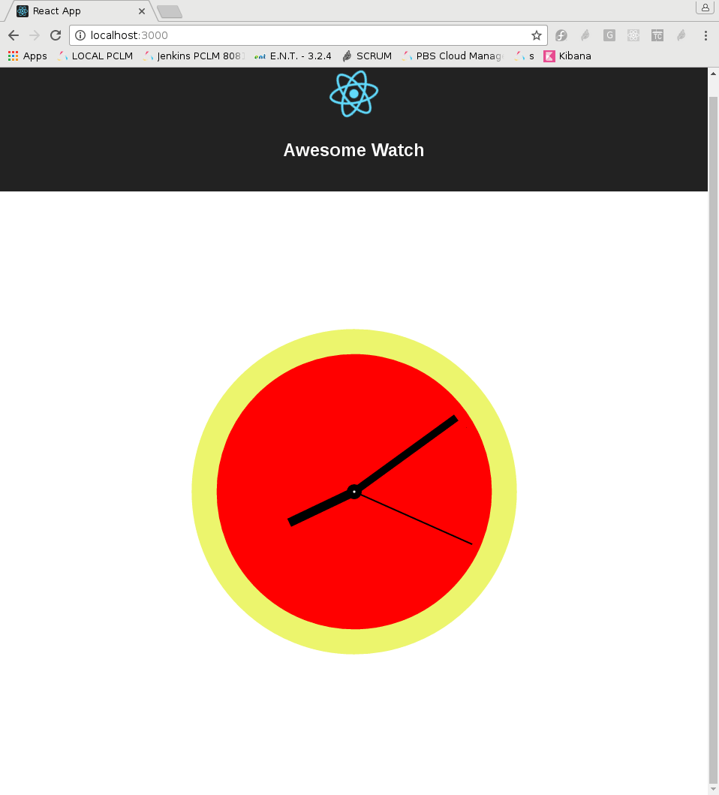

TP montre mécanique
-------------------

Le but de ce TP est de faire une montre mécanique en SVG

Voici ce que l'on doit faire :



On utilisera create-react-app pour cela

La solution pour être correcte doit :

-	Afficher la montre avec :

	-	les trois aiguilles
	-	le bord de la montre
	-	le background de la montre
	-	le petit point au centre du cadran

-	Disposer de plusieurs composants React (A vous de réfléchir exactement lesquels, et comment les réutiliser)

-	Tester que 00:00:00 fonctionne correctement

-	Tester que 19:38:38 fait en sorte que les trois aiguilles sont quasi confondues

-	Utiliser des couleurs venant d'un objet JSON pur

```
var colors = {
watchBorder: '#ecf56d',
			 watchBackground: 'red',
			 innerCircle: 'black',
			 innerDot: 'white',
			 needleColor: 'black'
};
```

-	Le composant principal doit accepter

Voici quelques liens pour vous aider :

-	http://setosa.io/ev/sine-and-cosine/
-	https://facebook.github.io/react/docs/react-component.html
-	Le README qui a été créé après avoir fait create-react-app

Barême : 5 points pour ESLint, 12 points de fonctionnalité et 3 points de Bonus si le code est particulièrement propre.

Bonus
-----

Questions bonus

-	Faire en sorte que l'on puisse changer de couleur la montre en cliquant sur le fond (la couleur change alors instantanément)
-	Ajouter un bouton de type checkbox pour afficher l'heure en mode digital ou en mode mécanique
-	Faire en sorte que l'on puisse changer l'heure dans un formulaire à droite
